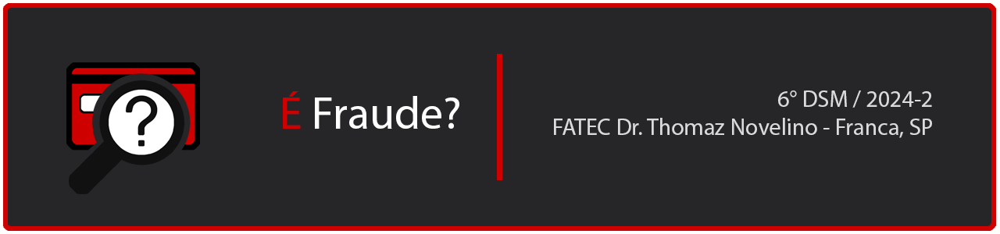

 

 

    <a href="#sobre">Sobre</a> |
    <a href="#equipe">Equipe</a> |
    <a href="#apresentacao">Apresentação</a>

---

  
## :bookmark_tabs: Sobre

**É Fraude?** é um projeto interdisciplinar desenvolvido durante o 6º semestre do curso de **Desenvolvimento de Software Multiplataforma** na Fatec Franca.  
O objetivo principal é oferecer uma solução para detecção de fraudes em transações de cartão de crédito, utilizando tecnologias modernas como aprendizado de máquina e análise de dados.  

---

  
## :clapper: Apresentação

**Youtube:**

---

  
## :busts_in_silhouette: Equipe

| Nome                     | LinkedIn & GitHub                                                                                                                                                   |
|-------------------------- |------------------------------------------------------------------------------------------------------------------------------------------------------------------- |
| Gabriel Vinicius Pagnan  |   |
| Leonardo Alves Costa     |   |
| Rafael Malaquias Chioca  |   |

---

<a href="#topo">Voltar ao topo</a>

